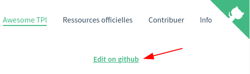
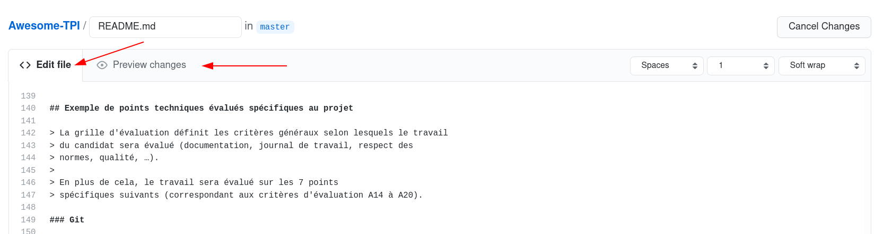
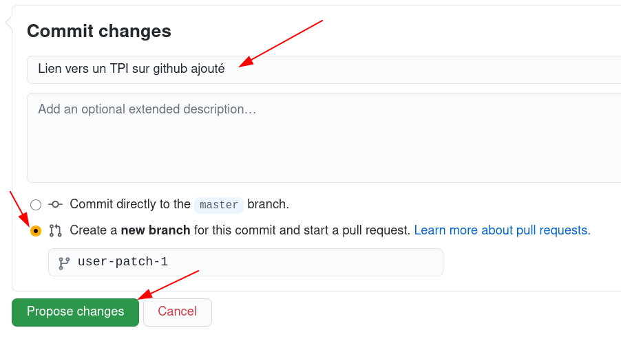

# Comment contribuer à Awesome-TPI

Awesome-TPI est ouvert à tout le monde et y contribuer est simple : vous avez 
besoin uniquement d'un compte [GitHub](https://github.com/).

Il y a plusieurs moyen d'y apporter des modifications, voici quelques exemples.

## Directement sur Github (simple)

1. Rendez-vous sur le site [Awesome-TPI](https://ponsfrilus.github.io/Awesome-TPI/) et visitez la page que vous souhaitez modifier.
2. Cliquer sur "Edit on github"  
     
   pour ouvrir la source de la page directement sur github.com.
3. En admettant que vous êtes connecté sur votre compte github, vous pouvez changer le contenu de la page en utilisant la syntaxe [MarkDown](https://guides.github.com/features/mastering-markdown/):  
    
4. Assurez-vous de prévisualiser vos modifications avec l'onglet "Preview changes".
5. Lors que vous êtes satisfait de vos modifications, utilisez le formulaire en bas de page pour les proposer :  
    
   * Assurez-vous de mettre un titre xplicite ;
   * Une description si nécessaire ;
   * De créer une nouvelle branche pour la pull request ;
   * Puis cliquez sur "Propose changes"
6. Ceci va créer une Pull Request (que vous pouvez consulter sur l'[onglet idoine](https://github.com/ponsfrilus/Awesome-TPI/pulls).
7. Lors qu'elle sera validée, vos modificatios seront accessibles à tout le monde.

## En forkant le repo (normal)

Bien que les modifications sur Github soient conviviales pratiques pour les
novices, elles ne permettent pas de tester les modifications, d'éditer la
structure du site, ou de faire évoluer le numéro de version dans le même commit.

1. Forkez le repo sur votre compte GitHub
2. Clonez votre repository
3. Depuis le répertoire du projet, faites un `make install`
   * Cela install les dépendances `npm` (`docsify-cli`),
   * et lance le serveur de test sur http://localhost:3000
4. Testez vos modifications
5. Assurez-vous d'incérmenter le numéro de version dans le fichier `package.json`
6. Vous pouvez automatiquement mettre à jour le fichier `CONTRIBUTORS.md` avec la commande `make CONTRIBUTORS.md`, ou l'éditer manuellement.
7. Commitez vos modifications dans votre branches et poussez les,
8. Depuis votre fork, créez la Pull Request.
